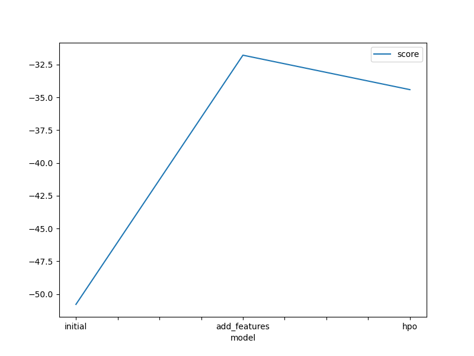
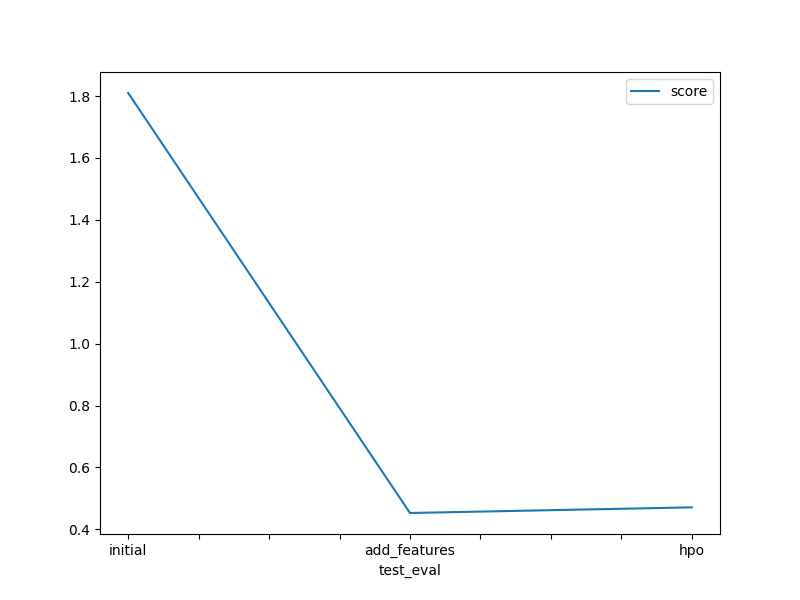

# Report: Predict Bike Sharing Demand with AutoGluon Solution
#### Lester Bryan F. Ilao

## Initial Training
### What did you realize when you tried to submit your predictions? What changes were needed to the output of the predictor to submit your results?
Ans: There are some columns the is not necessary. As said on step 3, "casual" and "registered" are needs to be ignored so I modify the train data by dropping these columns.

### What was the top ranked model that performed?
Ans: The best model in the initial training was "WeightedEnsemble_L3".

## Exploratory data analysis and feature creation
### What did the exploratory analysis find and how did you add additional features?
Ans: The datetime column is difficult to understand so I break it down into multiple columns such as year, month, day and hour.

### How much better did your model preform after adding additional features and why do you think that is?
Ans: Comparing to the intial model, the model with additional features was significantly better.

## Hyper parameter tuning
### How much better did your model preform after trying different hyper parameters?
Ans: Comparing the model with additional features and model with hyper parameters, the model with additional features was slightly better. This maybe due to some some hyperparameters that I included in the model.

### If you were given more time with this dataset, where do you think you would spend more time?
Ans: EDA and hyperparameter tuning. For EDA, I only included basic data visualization while in the hyperparameter tuning, I wasn't able to explored other parameters that can be used to improve my model.

### Create a table with the models you ran, the hyperparameters modified, and the kaggle score.
|model|hpo1|hpo2|hpo3|score|
|--|--|--|--|--|
|initial|default|default|'CAT': {'iterations': 10000}|1.81002|
|add_features|default|default|'RF': {'n_estimators': 300}|0.45275|
|hpo|default|default|'XT': {'n_estimators': 300}|0.47101|

### Create a line plot showing the top model score for the three (or more) training runs during the project.

### Create a line plot showing the top kaggle score for the three (or more) prediction submissions during the project.

## Summary
Ans: All in all, I was able to apply all of the processes and necessay steps I learned from the first module. I was able to modify an existing and use it to train model with different approaches. I was able to compared these models and choose which model was the best and how I can tweak it to improve its performance.
